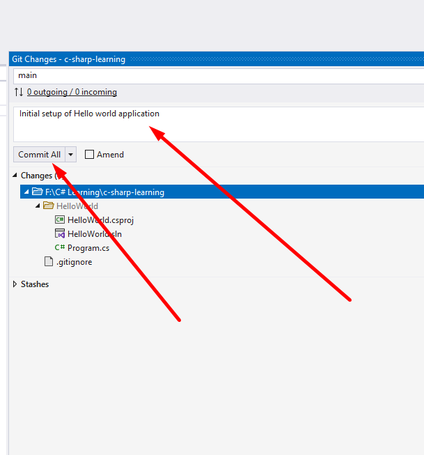

## Download and install Git in your computer

Git must be installed in your system to be able to clone / sync your commits to github, please goto https://git-scm.com/downloads and download latest version of git.

## Create a new repository

Create a new repository in your github account and clone the same in your computer.

1. Login to your github account, goto repositories, click on New Or navigate to https://github.com/new
2. Provide repository name and description
3. Select as Public repository
4. Click on Add a README file checkbox
5. Click on Create repository button.


## Cloning the new repository.

1. Create new folder where you want to clone the repository, example: `D:/CSharp`
2. Copy the repository clone URL from github, example: https://github.com/vignesh-uj/c-sharp-learning.git

3. Open the folder `D:/CSharp` in command prompt.
4. Use command `git clone <CLONE_URL>` example: `git clone https://github.com/vignesh-uj/c-sharp-learning.git` and press enter.
5. Git may ask you to enter the Github credentials to connect to your account, please enter the credentials as prompted.
6. Clone command will download the repository, and automatically creates the new folder with the name of your repository. So the final folder structure would be like : `D:/CSharp/c-sharp-learning`. (Note the new folder got created which is named as same as the repository)

## Creating your first commit using Visual Studio

Once the repository is cloned, we can open the folder in Visual Studio and create new files / projects.

1. Open Visual Studio, create new Console Application called `HelloWorld` in the target folder `D:/CSharp/c-sharp-learning`.
2. Once the Visual Studio creates necessary files, you can see the git information at the bottom right corner of Visual Studio or in the Git Changes panel.

3. You can see all the changed / newly created files as part of the application in your repository.
4. Ignoring unwanted files from your repository. Sometimes we need the file in our local system but not in github repository, we can ignore them by adding an entry to .gitignore file. 
Go to `D:/CSharp/c-sharp-learning` and create a new file called `.gitignore` using notepad, and add the below entries:
```
obj
.vs
```
Now if you switch to Visual Studio and check the Git Changes panel, you will see `obj` and `.vs` folders are ignored and will not be committed.

5. Committing the changes. Committing the changes will help you to save the new files / changed files in the repository so others can see it. You can do that by providing a commit message and pressing `Commit All` button in Visual Studio.



6. Finally press the Sync button to sync all commits to the remote server (if this is not done the commits will be still be in local).
7. Now if you navigate to github.com and open the repository you created, you should see a new folder called `HelloWorld` and all the files inside the folder.

## Creating new branch for every task

It is recommended to create a new branch for every task, so others can easily review the same.

1. When you start with any new task, first create a branch from existing branch. Go to Visual Studio and look for New branch option:


2. Enter the new branch name - example `data-types-task-1`.
3. Select the previous branch as Based on branch.
4. Ensure Checkout branch option is selected.
5. Click on Create.
6. New branch will be created and you can do the changes related to the tasks and finally commit those changes.